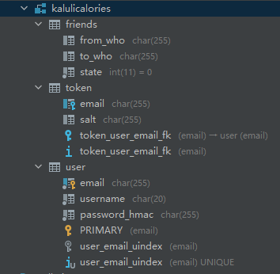

# 卡路里calories


2020年第八届全国大学生数字媒体科技作品及创意竞赛

移动应用开发组 决赛编号B3-227

全国一等奖

## 项目介绍

本项目设计上为健康 app ，前端基于使用 Dart 的 Flutter 框架，后端基于使用 Python 的 Flask 框架开发。

并在后端部署了 nginx ，提供 https 服务并转发至 Flask 服务器，因含有证书文件与配置简单，开源仓库不包括 nginx 相关文件。

同时，后端使用 Mariadb 作为数据库，开发者请自行部署并修改后端服务器数据库配置。(main.py 内)

后端基于 JWT (Json Web Token) 进行鉴权，密码存储使用 hmacSHA256 + salt ，具体实现请查看源码。

因为是业余项目，所以安全性并不高，请勿将后端安全方案用于生产环境。

## 开发环境

```
语言环境：Flutter(Flutter SDK)、Python3、Flask(import引入使用)。

IDE：IDEA、Pycharm、DataGrip。

后端：nginx(代理转发、https、http2)

数据库：Mariadb(正在替换sqlite中)
```

数据库表结构：



## 项目开发文档

整套项目耗费了太多的精力，开发了2个月实现了大半功能，~~剩下一小部分不想做了~~，开源给各位参考使用。

账号以 email 地址作为唯一标识符，用户名和密码可更改，数据库 user 表字段全非空。

token 表字段可空，friends 表存储好友信息。数据结构为有向图，数据库存储图路径。from 为好友申请发起人，state 1 为未接受。

state 2 为接受，修改时添加对向路径，账户节点构成双向。

客户端持久化使用 user 文件夹下的 UserProfile ，使用方式查看 logic 文件夹内 user 相关源码。

BMI计算器内置数据，数据来源为《中国成人超重与肥胖症预防控制指南》与《中国学龄儿童青少年超重、肥胖筛查体重指数值分类标准》两篇论文。

体重记录的图表为 Flutter 自绘，原计划使用样条插值绘制曲线(没学会，没写完)。

饮食记录没实现好，每日数据的结构不太好搞，所以也没完成。

好友功能完成了一半(大体框架设计好了，后端也写了查询，没写调用API而已)。

设置页面全部功能完成了，有点乱，请查看源码。

ui 设计部分严禁商用与转投其他比赛，开发者与项目队伍成员保留所有权力，其余部分技术性代码不做限制。

部分字体文件授权归属 Apple 与 汉仪公司，项目内不包含相关资源文件，使用请自行下载。

```
涉及到的部分字体：

开屏字体：HYZhuZiXiaoJingLingW.ttf (汉仪铸字小精灵W)

软件内字体：Helvetica.ttc、Hiragino Sans GB.ttc、PingFang.ttc(苹方)

具体字体配置请查看 Flutter 项目中的 pubspec.yaml 文件。
```

涉及汉仪公司字体部分，本项目遵循《汉仪字库个人非商用须知》使用。

```
个人非商用授权是指以个人为被许可主题，为个人学习、研究、欣赏之目的，以非商业产品运作的方式，使用汉仪公司的字体产品完成个人作品（包括但不限于个人论文、PPT等）的制作及展示。

仅限个人单机版使用许可字库，仅可用于个人学习、研究、欣赏目的，不可作任何商业发布或其他任何盈利性使用。
```

涉及腾讯SDK部分，请按照腾讯相关文档使用。此处调用 腾讯AI开放中心-多标签识别 API。

已参考腾讯官方 Python2 SDK 实现了可用的Python3 SDK，完成了鉴权与调用部分编写。

涉及邮件发送部分，此处使用 QQ邮箱 相关服务，请自行修改。

此项目不会带有详细的开发文档，如有疑问请邮件联系开发者 Ricardo2001zg 。


## 特别鸣谢

设计师 周周，Yurffi Wang，Gretal Lee。

## 后记

太累了不想干了QAQ，我一个想做游戏的，做啥移动应用 app (虽然 Flutter 确实很好玩)，所以不干了！

Email 的 html 抄 Steam 的(小声)，反正我觉得还能看(超小声)。